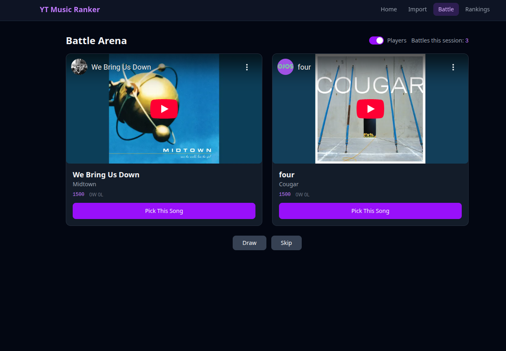

# YouTube Music Ranker

A web app to rank your YouTube Music songs through head-to-head battles using the Glicko-2 rating system.



## Features

- **Import Playlists** -- Paste a YouTube Music or Spotify playlist URL to import all songs
- **Head-to-Head Battles** -- Songs compete against each other with embedded YouTube playback
- **Glicko-2 Rankings** -- Statistically robust ranking system with rating deviation tracking
- **Smart Matchmaking** -- Prioritizes uncertain songs (high RD) and avoids repeat matchups
- **Share Rankings** -- Generate shareable links for your rankings

## Tech Stack

- **Frontend**: React, TypeScript, TailwindCSS, Vite
- **Backend**: Express, TypeScript
- **Database**: SQLite (via sql.js)
- **YouTube Music**: ytmusic-api (unofficial)
- **Spotify**: Spotify Web API (per-user developer credentials)
- **Rating System**: Glicko-2

## Getting Started

### Prerequisites

- Node.js 18+

### Install

```bash
npm install
cd client && npm install
cd ../server && npm install
```

### Spotify Setup (optional)

Spotify playlist import is opt-in per user — no server-side configuration needed. You must have a Spotify premium account. To enable it for your account:

1. Go to the [Spotify Developer Dashboard](https://developer.spotify.com/dashboard) and create a free app
2. On the Import page, paste a Spotify playlist URL — a credentials form will appear
3. Enter your Client ID and Client Secret and click Save

Credentials are stored in your personal database and never shared.

YouTube Music import works without any configuration.

### Development

Run both client and server concurrently:

```bash
npm run dev
```

Or run them separately:

```bash
npm run dev:client   # Vite dev server on :5173
npm run dev:server   # Express API on :3001
```

The Vite dev server proxies `/api` requests to the Express backend.

### Production Build

```bash
npm run build
npm start
```

### Docker

The Docker setup includes the app and a [Caddy](https://caddyserver.com/) reverse proxy that automatically provisions HTTPS via Let's Encrypt.

#### 1. Configure your domain

Edit `Caddyfile` and replace `yourdomain.com` with your actual domain:

```
mysite.example.com {
    reverse_proxy app:3001
}
```

#### 2. Point DNS at your server

Add an **A record** for your domain pointing to your server's IP address.

#### 3. Build and start

```bash
docker compose up -d --build
```

Caddy will automatically obtain a TLS certificate once DNS propagates. Your site will be available at `https://yourdomain.com`.

#### Running without HTTPS

If you don't have a domain and just want to access the app by IP, replace the `Caddyfile` contents with:

```
:80 {
    reverse_proxy app:3001
}
```

This serves plain HTTP on port 80 with no certificate.

#### Data persistence

SQLite databases are stored in a named Docker volume so they survive restarts and rebuilds. To find where the volume lives on the host:

```bash
docker volume ls
docker volume inspect <volume-name>
```

To browse the files directly inside the container:

```bash
docker compose exec app ls /app/server/data/
```

To stop the container without deleting data:

```bash
docker compose down
```

To stop and **delete all data** (including Caddy certificates):

```bash
docker compose down -v
```

## Admin

An admin dashboard is available at `/admin` for users flagged as admins. It shows all registered users, their song counts, battle stats, completion percentages, and top-ranked songs. Click any user to see their full rankings and recent battles.

### Promoting users to admin

Set the `ADMIN_EMAILS` environment variable to a comma-separated list of email addresses. Users matching those emails are promoted to admin on every server startup.

**Local development** -- add to `server/.env`:

```
ADMIN_EMAILS=you@example.com,other@example.com
```

**Docker** -- add to `docker-compose.yml` under the `app` service environment:

```yaml
app:
  environment:
    - ADMIN_EMAILS=you@example.com
```

Then restart the server. The promotion is idempotent and runs on every startup, so updating the list and restarting is all that's needed.

## Usage

1. Go to **Import** and paste a YouTube Music or Spotify playlist URL
2. Head to **Battle** to start ranking songs head-to-head
3. View your **Rankings** leaderboard
4. Click **Share** to generate a link others can view

## Importing Uploaded Songs

YouTube Music doesn't expose private/uploaded songs via its API. Use the included scraper script to export them.

### 1. Install scraper dependencies

```bash
cd scripts
npm install
```

### 2. Launch Chrome with remote debugging

The scraper connects to a real Chrome session so Google doesn't block the login. You must close any existing Chrome windows first, then run:

```bash
google-chrome --remote-debugging-port=9222 --user-data-dir=/tmp/chrome-debug
```

Log into your YouTube Music account in that window and navigate to your uploaded songs library if it doesn't redirect automatically.

### 3. Run the scraper

In a separate terminal:

```bash
cd scripts
node scrape-uploads.js
```

The script opens `https://music.youtube.com/library/uploaded_songs`, scrolls through the full list (may take a few minutes for large libraries), and saves title/artist data to `scripts/uploads.json`.

### 4. Import into the database

Stop the dev server first, then run from the project root:

```bash
node scripts/import-uploads.js
```

This inserts all songs with placeholder IDs (`local:...`). Fast — no API calls.

### 5. Enrich with real YouTube video IDs

```bash
node scripts/enrich-uploads.js
```

Searches YouTube Music for each song by title and artist, then replaces placeholder IDs with real video IDs and metadata. This is slow (~300ms per song) but saves progress every 50 songs, so you can safely interrupt with Ctrl+C and rerun to continue where it left off.
